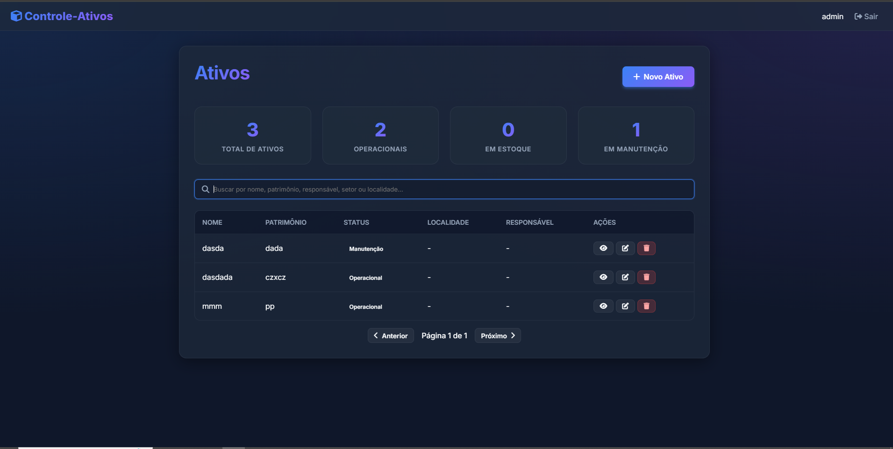
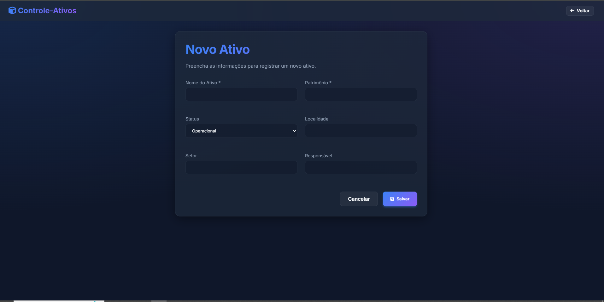

# Controle de Ativos

Este projeto surgiu inicialmente como uma iniciativa de estudos em tecnologias **Spring Boot**, mas devido uma necessidade pessoal de trabalho agora é utilizado para gerenciamento de ativos.

O sistema permite o controle, mapeamento e manutenção de ativos (como equipamentos de TI)

## Tecnologias Utilizadas

O projeto utiliza as seguintes stacks:

- **Backend:** Java 21 com Spring Boot 3
- **Segurança:** Spring Security (Controle de acesso)
- **Banco de Dados:** PostgreSQL hospedado no **[Neon DB](https://neon.tech/)**
- **Persistência:** Spring Data JPA / Hibernate
- **Deployment:** **[Railway](https://railway.app/)**
- **Interface:** HTML, CSS e JavaScript
- **Integração:** Apache POI (Para leitura e importação de arquivos Excel `.xlsx`) (em andamento)  (export em txt atualmente)
- **Documentação API:** Estudos noSwagger / OpenAPI


## Demonstração

Abaixo estão algumas capturas de tela do sistema no front inicial, ja alterado no momento atual:

### Dashboard / Lista de Ativos


### Cadastro do Ativo


### Login


## Principais Funcionalidades

- **Gestão de Ativos:** Cadastro, edição e exclusão de itens.
- **Segurança:** Autenticação e autorização para proteger os dados.
- **Interface Responsiva:** Visual limpo e intuitivo para facilitar o uso cotidiano.


## Como Executar (Localmente)

Para rodar o projeto em seu ambiente:

1. Clone o repositório.
2. Certifique-se de ter o **Java 21** e **Maven** instalados.
3. Configure as variáveis de ambiente ou o `application.properties` com suas credenciais do banco de dados.
4. Execute o comando:
   ```bash
   mvn spring-boot:run
   ```
