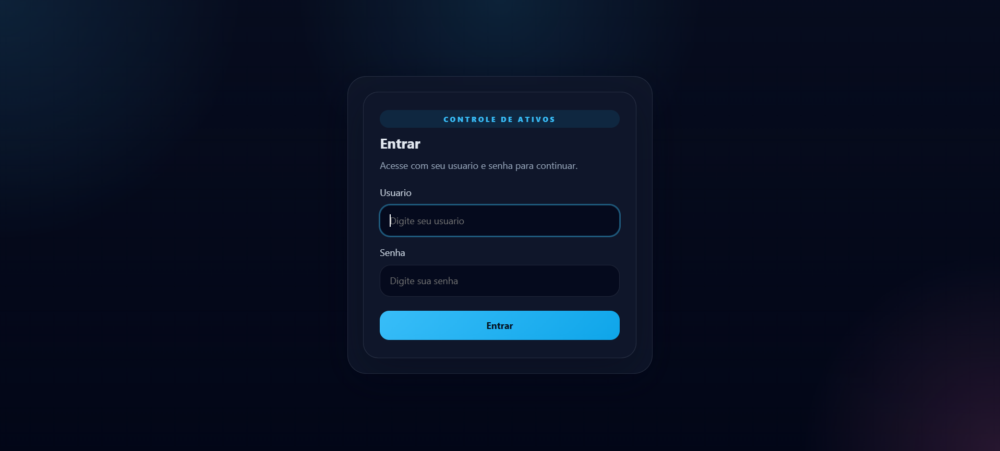
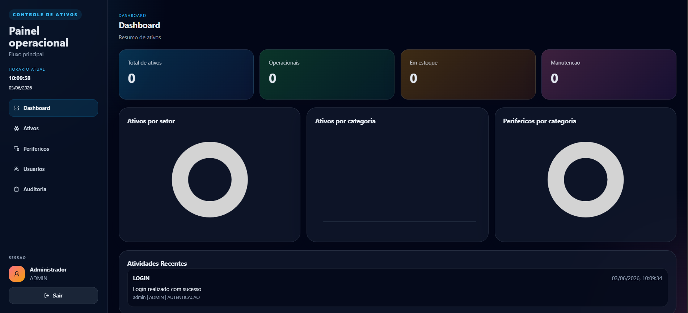
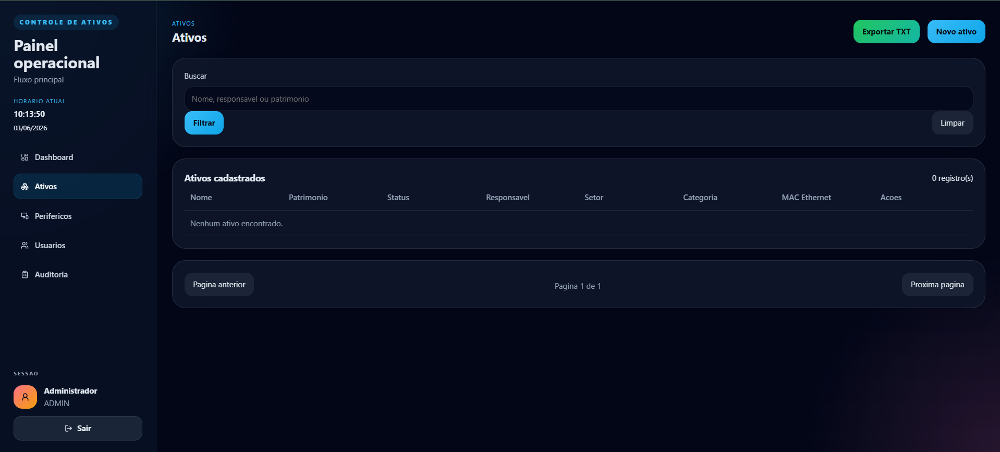
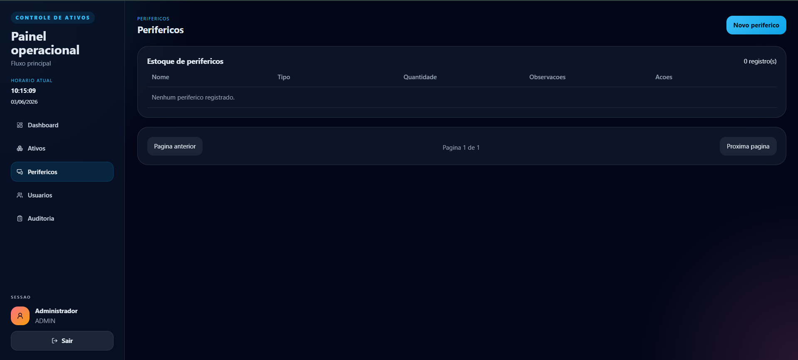
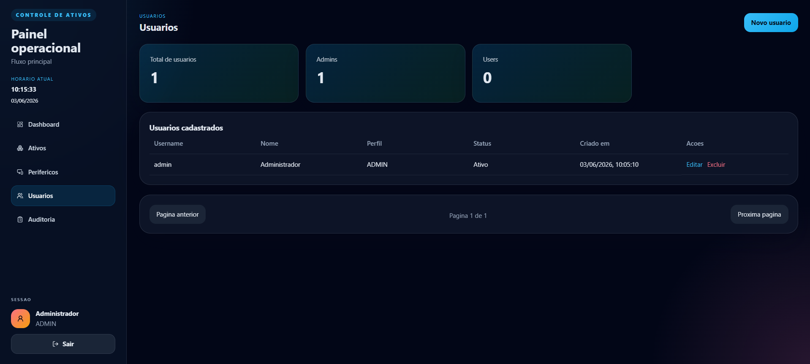
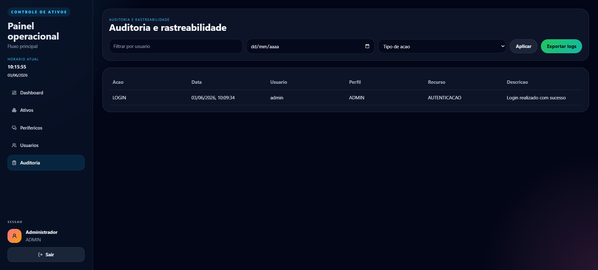

# Controle de Ativos

Sistema web para controle operacional de ativos de TI, perifericos, usuarios e auditoria. O projeto e dividido em um backend Java com Spring Boot e um frontend React com Vite.

## Visao Geral

O sistema permite cadastrar, consultar, editar, excluir e exportar ativos, alem de acompanhar indicadores em dashboard. Tambem possui controle de perifericos, gerenciamento de usuarios administradores/usuarios comuns e trilha de auditoria das principais acoes.

## Funcionalidades

- Autenticacao com Spring Security usando sessao HTTP, cookies e CSRF.
- Controle de acesso por perfil: `ADMIN` e `USER`.
- Dashboard com resumo de ativos, perifericos e, para administradores, usuarios.
- CRUD de ativos com filtros por termo, nome, responsavel e patrimonio.
- Exportacao de ativos em arquivo `.txt` com limite de registros.
- CRUD de perifericos com quantidade por tipo.
- CRUD de usuarios restrito a administradores.
- Auditoria de login, logout, criacao, atualizacao, exclusao e acesso negado.
- API documentavel via Swagger/OpenAPI.

## Tecnologias

### Backend

- Java 21
- Spring Boot 3.5
- Spring Web
- Spring Security
- Spring Data JPA / Hibernate
- Bean Validation
- Lombok
- PostgreSQL em producao
- H2 em memoria para desenvolvimento local
- Apache POI preparado para importacao de planilhas
- Springdoc OpenAPI / Swagger UI

### Frontend

- React 19
- TypeScript
- Vite
- React Router
- Axios
- ECharts
- Lucide React
- Tailwind CSS

## Estrutura Do Projeto

```text
.
|-- src/
|   |-- main/
|   |   |-- java/com/matheus/controle/ativos/
|   |   |   |-- config/        # seguranca, CORS e inicializacao
|   |   |   |-- controller/    # endpoints REST
|   |   |   |-- exception/     # tratamento de erros
|   |   |   |-- model/         # entidades, enums e DTOs
|   |   |   |-- repository/    # Spring Data JPA
|   |   |   `-- service/       # regras de negocio
|   |   `-- resources/         # application.properties e profile prod
|   `-- test/
|-- frontend/
|   |-- src/
|   |   |-- components/
|   |   |-- hooks/
|   |   |-- pages/
|   |   `-- services/
|   |-- package.json
|   `-- vite.config.ts
|-- pom.xml
|-- Dockerfile
`-- nixpacks.toml
```

## Telas Do Sistema

### Login



### Dashboard



### Ativos



### Perifericos



### Usuarios



### Auditoria



## Fluxo De Autenticacao

O frontend usa `axios` com `withCredentials: true`, entao a autenticacao nao e feita por JWT. O fluxo atual e:

1. O React busca um token CSRF em `GET /api/auth/csrf`.
2. O login envia usuario e senha para `POST /api/auth/login`.
3. O backend valida as credenciais, cria uma sessao HTTP e grava os dados do usuario.
4. O frontend consulta `GET /api/auth/status` para saber se a sessao continua ativa.
5. Rotas internas usam `ProtectedRoute`; rotas administrativas usam `AdminRoute`.

## Principais Endpoints

| Recurso | Endpoint | Acesso |
| --- | --- | --- |
| Autenticacao | `/api/auth/*` | Publico |
| Dashboard | `/dashboard` | `ADMIN`, `USER` |
| Ativos | `/ativos` | `ADMIN`, `USER` |
| Perifericos | `/perifericos` | `ADMIN`, `USER` |
| Usuarios | `/usuarios` | `ADMIN` |
| Auditoria | `/auditorias` | `ADMIN` |


### Requisitos

- Java 21
- Maven ou Maven Wrapper
- Node.js
- npm

